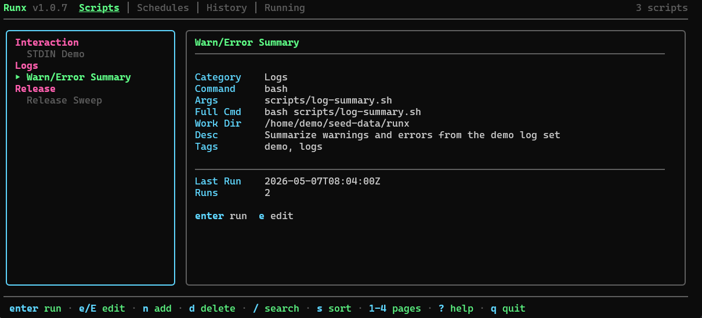
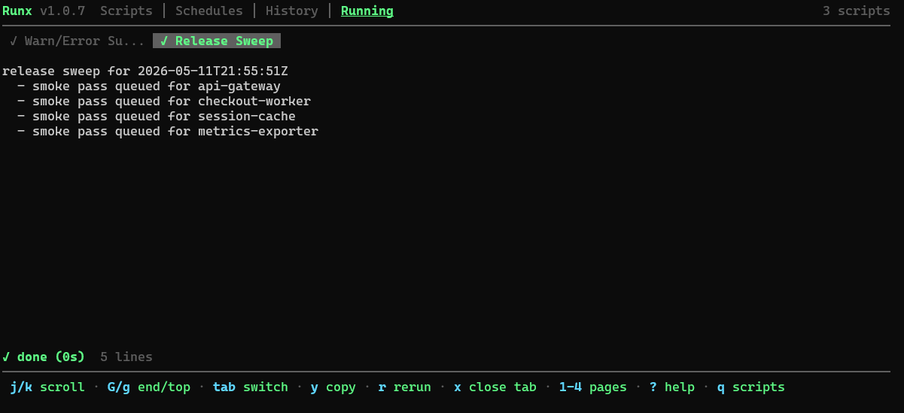

# runx

Terminal script runner with saved commands, live output, schedules, and execution history. `runx` is meant for repeatable dev tasks you want one keypress away without digging through shell history or half-finished notes.



**Live demo:** [froesch.dev](https://froesch.dev)

## Release Status

Developed for WSL2/Linux first. Cross-platform testing and bug fixing for macOS and native Windows are still in progress.

Linux, WSL2, and macOS are the primary targets today. Windows binaries and installer entrypoints are available, but native Windows should still be treated as experimental.

## Install

Quick install:

```bash
curl -fsSL https://raw.githubusercontent.com/LFroesch/runx/main/install.sh | bash
```

Experimental native Windows install:

```powershell
irm https://raw.githubusercontent.com/LFroesch/runx/main/install.ps1 | iex
```

Direct installers: [`install.sh`](https://raw.githubusercontent.com/LFroesch/runx/main/install.sh), [`install.ps1`](https://raw.githubusercontent.com/LFroesch/runx/main/install.ps1)

If you cloned the repo already:

```powershell
./install.ps1
```

```bat
install.cmd
```

Other options:

```bash
go install github.com/LFroesch/runx@latest
make install
```

Run:

```bash
runx
runx --version
runx --config /path/to/scripts.json
```

## Media



## Pages

| Page | Purpose |
|------|---------|
| Scripts | Saved commands, categories, filters, and launch flow |
| Schedules | Interval-based runs and enable or disable state |
| History | Stored output from previous runs |
| Running | Live output for active or completed executions |

## Features

- Register scripts once and run them quickly
- Stream output live in the terminal
- Run multiple scripts at the same time
- Keep output history under `~/.local/share/runx/`
- Schedule interval-based jobs inside the app
- Prompt for placeholders before execution
- Pass environment variables per script
- Handle many text, password, and yes/no prompts in-app while a script is running

Scripts are stored in `~/.config/runx/runx-scripts.json` by default.

## Placeholders

`runx` supports placeholders in commands and args:

- `{{name}}`
- `{{name=default}}`
- `{{name:Description=default}}`

This is useful for things like branch names, hostnames, or deploy modes that change per run.

It also supports optional flag-style placeholders, so a missing choice can cleanly omit an argument instead of leaving a stub behind.

## Notes

- The scheduler is in-app. Jobs only fire while `runx` is open.
- Scheduled runs are interval based, with a minimum of one minute.
- Full-screen terminal apps like `vim`, `fzf`, `less`, or `top` are not a good fit yet.
- Plain `sudo` and some SSH password prompts do not behave well because those tools often read from `/dev/tty` instead of stdin.

## Controls

| Key | Action |
|-----|--------|
| `1/2/3/4` | Switch pages |
| `enter`, `space` | Run selected script |
| `n` | Add script |
| `e` | Edit script |
| `E` | Edit referenced script file |
| `/` | Search |
| `s` | Change sort or stop a running script depending on page |
| `tab` | Switch running-output tab |
| `r` | Rerun completed script from Running |
| `y` | Copy output |
| `esc` | Cancel active stdin prompt |
| `x` | Close completed run tab |
| `?` | Help |
| `q` | Quit |

## License

[AGPL-3.0](LICENSE)
